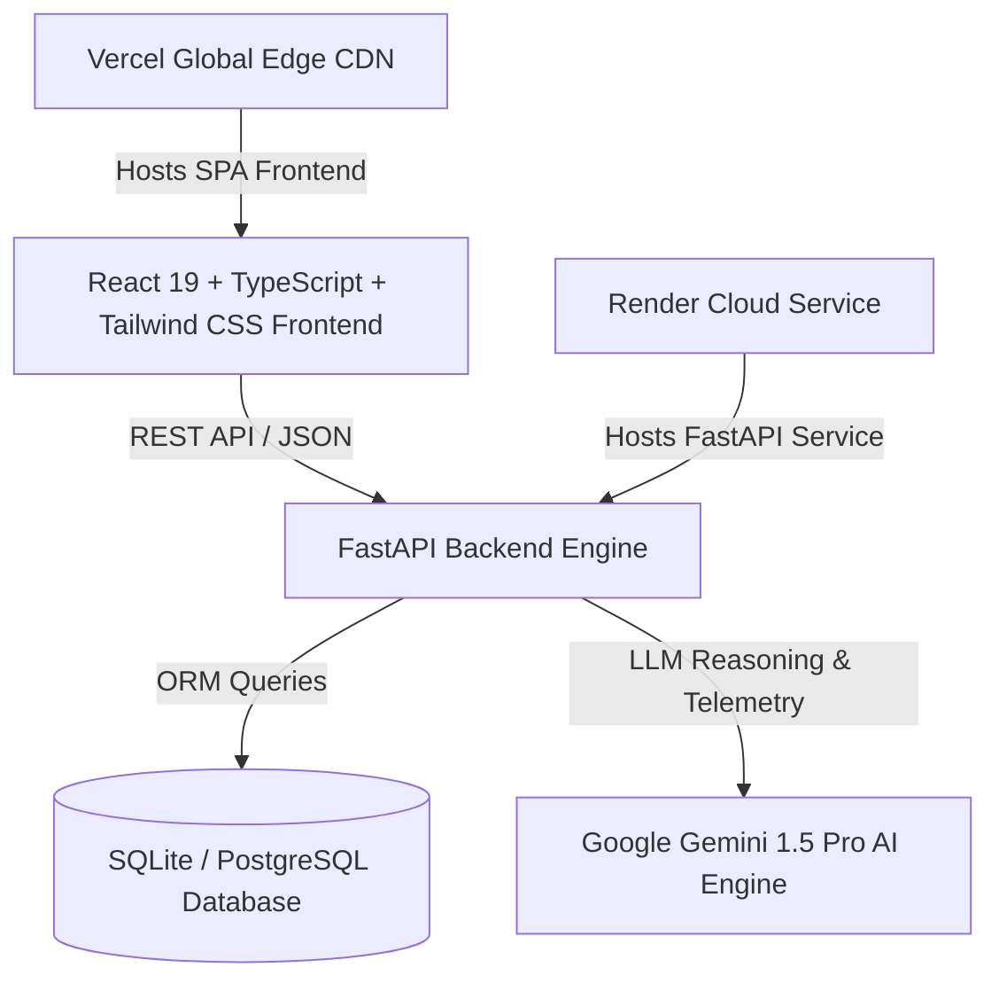

# 🛡️ ProjectPilot AI — Autonomous AI Project Governance Platform

> ProjectPilot AI is an **Autonomous AI Project Governance Platform** designed to solve the critical question in software engineering: *"Are we building what we promised, on time, within baseline scope?"*

---

## 🌐 Live Production Application

- **Frontend Application (Vercel Edge)**: [https://frontend-brown-xi-96.vercel.app](https://frontend-brown-xi-96.vercel.app)
- **Backend API Engine (Render Cloud)**: [https://projectmindi-ai.onrender.com](https://projectmindi-ai.onrender.com)
- **API Documentation**: [https://projectmindi-ai.onrender.com/docs](https://projectmindi-ai.onrender.com/docs)

---

## 📌 Problem Statement

Managing software engineering projects involves coordinating tasks, tracking progress, monitoring deadlines, and ensuring development stays strictly aligned with original PRD specifications. Traditional software like Jira, Trello, or Asana suffer from key flaws:
1. **Scope Creep & Drift**: Cosmetic feature requests expand unnoticed, delaying core baseline requirements.
2. **Reactive Risk Management**: Bottlenecks are discovered only *after* release deadlines slip.
3. **Manual Management Overhead**: Engineering leadership spends 30% of their bandwidth writing status summaries and parsing backlog tickets.

---

## 💡 Solution: ProjectPilot AI Governance Platform

ProjectPilot AI places **AI Intelligence** at the center of project governance. It acts as an autonomous Chief Technology Officer & Engineering Manager:

### 1. 🛡️ Flagship AI Scope Audit Engine
- Extracts structured **Project Blueprints** (Requirements, Milestones, Deliverables, Acceptance Criteria) from raw PRD specifications.
- Continuously audits active task execution against baseline specs to compute **Scope Alignment %**, **Missing PRD Requirements**, and **Out-of-Scope Work Alerts** (e.g. *Dark Mode Refinement - Unplanned in PRD*).

### 2. ⚡ Evidence-Driven AI Recommendation Engine
- Every recommendation is backed by structured evidence:
  - **Observation** → **Root Cause / Reason** → **Strategic Impact** → **Suggested Action** → **Expected Benefit** → **Evidence Citations**.
- **1-Click Execution**: Instantly reassigns developer velocity and updates task priorities in the database.

### 3. 🎛️ 5-Second Executive Command Center
- Designed for instant visual storytelling: *Project Health (92%) → Active Risks → AI Recommendations → Predicted Outcome → 1-Click Action*.
- Interactive Natural Language Query Bar with suggested chips ("What features are outside scope?", "Why is Beta Launch delayed?").

### 4. 📄 C-Suite Executive Governance Reports
- Generates publication-ready daily/weekly executive reports with 1-click **PDF Export** (`html2pdf.js`).

---

## 🏗️ Architecture Overview

---
