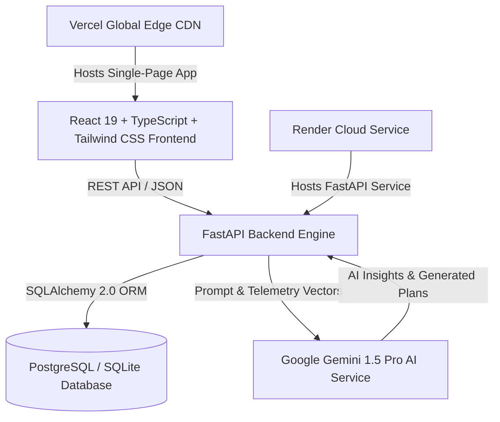

# ProjectPilot AI — Autonomous AI Project Manager & Intelligence Platform

[]()
[](https://fastapi.tiangolo.com/)
[](https://react.dev/)
[](https://tailwindcss.com/)
[](https://www.postgresql.org/)
[](LICENSE)

ProjectPilot AI is an autonomous, AI-driven project management assistant designed to transform raw project requirements into actionable plans, proactively monitor scope drift, identify risk bottlenecks, and generate executive insights in real-time.

---

## 📌 Problem Statement

Traditional project management software relies heavily on manual status updates, manual task assignment, and static Gantt charts. As projects scale:
1. **Scope Creep Goes Unnoticed**: Feature requests expand without formal scope tracking, causing budget overruns.
2. **Risks Are Reactive**: Issues are identified only after milestones are missed.
3. **Manual Overhead**: Engineering managers spend up to 30% of their time writing standup summaries, status reports, and updating tickets.

---

## 💡 Solution: ProjectPilot AI

ProjectPilot AI acts as a **24/7 Co-Pilot for Engineering Managers and Product Teams**. By integrating LLM reasoning (Google Gemini 1.5) with real-time task telemetry:
- **Instant Plan Generation**: Turns a single high-level prompt into a fully populated project PRD, task hierarchy, milestone roadmap, and risk matrix.
- **Scope Guardian**: Automatically compares incoming task additions against baseline PRD requirements to flag unauthorized scope drift.
- **AI Risk Engine**: Identifies developer bottlenecks, tight deadlines, and external dependencies before they become blockers.
- **Automated Insights**: Generates daily standup digests, health scores, and executive summaries with one click.

---

## ✨ Key Features

- 🚀 **Interactive AI Planner**: Generate full project plans with customized tech stacks, team size, and milestone targets.
- 📊 **Executive Dashboard**: Real-time project health scores, completion metrics, milestone progress, and task velocity.
- 📋 **Kanban Task Board**: Drag-and-drop task workflow management with priority tags, status filtering, and assignee tracking.
- 🛡️ **Scope Guardian**: Requirement baseline alignment monitoring with scope drift warning badges.
- ⚡ **Risk Center**: Automated risk identification, severity classification, and mitigation tracking.
- 💬 **AI Assistant Chat**: Context-aware project assistant trained on your project's tasks, milestones, and team workloads.
- 👥 **Team Workload Management**: Monitor capacity utilization, overloaded team members, and task distribution.
- 📅 **Interactive Timeline & Calendar**: Visual project roadmap and deadline scheduler.
- 📄 **Automated Reports**: Generate standup reports, executive summaries, and downloadable PDF reports.

---

## 🏗️ System Architecture



For detailed architectural specifications, read [ARCHITECTURE.md](docs/ARCHITECTURE.md) and [ER_DIAGRAM.md](docs/ER_DIAGRAM.md).

---

## 🛠️ Tech Stack

### Frontend
- **Framework**: React 19, TypeScript, Vite
- **Styling**: Tailwind CSS v3, Glassmorphism design tokens, Lucide React icons
- **State & Data Fetching**: TanStack React Query v5, Axios
- **Routing**: React Router v7 with route splitting & `React.lazy`

### Backend
- **Framework**: FastAPI (Python 3.11+)
- **Database & ORM**: SQLAlchemy 2.0 (PostgreSQL in production, SQLite locally)
- **Configuration**: Pydantic-settings
- **AI Model**: Google Gemini 1.5 Pro via `google-generativeai`

---

## 🚀 Quickstart & Installation

### Prerequisites
- Node.js v18+ & npm
- Python 3.11+
- Git

### 1. Clone Repository
```bash
git clone https://github.com/star0089/ProjectMind-ai.git
cd ProjectMind-ai
```

### 2. Backend Setup
```bash
# Navigate to backend and setup virtual environment
cd backend
python -m venv .venv

# Activate virtual environment
# Windows:
.venv\Scripts\activate
# Linux/macOS:
# source .venv/bin/activate

# Install dependencies
pip install -r requirements.txt

# Return to root directory
cd ..
```

### 3. Environment Configuration
Copy the example environment files:
```bash
cp .env.example .env
cp frontend/.env.example frontend/.env
```

Add your **Google Gemini API Key** inside `.env`:
```env
GEMINI_API_KEY=your_actual_gemini_api_key_here
```

### 4. Seed Realistic Demo Data
Seed the database with **3 Projects, 50 Tasks, 10 Milestones, Risks, Scopes, and Team Workloads**:
```bash
python seed.py
```

### 5. Start Backend Server
```bash
python -m uvicorn backend.app.main:app --reload --port 8000
```
Backend API will be running at `http://localhost:8000` (Docs at `http://localhost:8000/docs`).

### 6. Frontend Setup & Launch
Open a new terminal window:
```bash
cd frontend
npm install
npm run dev
```
Frontend application will be accessible at `http://localhost:5173`.

---

## 🔐 Environment Variables

| Variable | Scope | Description | Default |
| :--- | :--- | :--- | :--- |
| `ENVIRONMENT` | Backend | Server environment mode (`development` / `production`) | `development` |
| `PORT` | Backend | HTTP server port | `8000` |
| `DATABASE_URL` | Backend | SQLAlchemy Connection String | `sqlite:///./projectpilot.db` |
| `GEMINI_API_KEY` | Backend | Google Gemini API Key | Required for AI features |
| `CORS_ORIGINS` | Backend | Allowed CORS Origins | `http://localhost:5173` |
| `VITE_API_BASE_URL` | Frontend | Backend API Base URL | `http://localhost:8000` |

---

## 📡 API Endpoints Reference

| Method | Endpoint | Description |
| :--- | :--- | :--- |
| `GET` | `/` | System health check & version status |
| `GET` | `/projects` | Retrieve all projects with search/filter |
| `POST` | `/projects` | Create a new project |
| `GET` | `/tasks` | List tasks filtered by project, status, priority |
| `POST` | `/tasks` | Create a new task |
| `PATCH` | `/tasks/{id}/status` | Update task workflow status |
| `GET` | `/scope` | Get scope baseline alignment score |
| `GET` | `/risk` | Get active project risks & mitigations |
| `POST` | `/chat` | Context-aware AI assistant question-answering |
| `POST` | `/planning/generate` | Generate automated project plan using Gemini AI |
| `GET` | `/insights/health` | Calculate real-time project health index |
| `GET` | `/insights/standup` | Generate automated AI standup report |

For full endpoint definitions, inspect [API_DOCS.md](docs/API_DOCS.md).

---

## 🌐 Production Deployment Guide

### Deploy Backend to Render
1. Create a new **Web Service** on [Render](https://render.com/).
2. Connect your GitHub repository.
3. Select **Docker** or use the included `render.yaml` manifest.
4. Set Build Command: `pip install -r backend/requirements.txt`
5. Set Start Command: `uvicorn backend.app.main:app --host 0.0.0.0 --port $PORT`
6. Add Environment Variables:
   - `DATABASE_URL`: Your PostgreSQL connection string (e.g. Render Postgres database URI)
   - `GEMINI_API_KEY`: Your Gemini API key
   - `CORS_ORIGINS`: `https://projectpilot-ai.vercel.app`

### Deploy Frontend to Vercel
1. Import repository into [Vercel](https://vercel.com/).
2. Select Root Directory: `frontend`
3. Framework Preset: `Vite`
4. Add Environment Variable:
   - `VITE_API_BASE_URL`: Your deployed backend URL (`https://projectpilot-backend.onrender.com`)
5. Deploy! Vercel will process single-page application routes according to `vercel.json`.

---

## 🖼️ Application Screenshots

| Dashboard Overview | Task Board Kanban |
| :---: | :---: |
| *(High-level health metrics, project stats, and recent activity)* | *(Drag and drop Kanban board with priority filters)* |

| Scope Guardian | AI Planner Engine |
| :---: | :---: |
| *(Requirement tracking & scope drift detection)* | *(Turn prompt ideas into complete structured project specs)* |

---

## 🔮 Future Scope

- 📱 **Mobile Native Application**: React Native companion app for iOS and Android.
- 🔌 **Third-Party Integrations**: Native bi-directional sync with GitHub Issues, Jira, Linear, and Slack notifications.
- 🤖 **Autonomous Task Agent**: Self-assigning task execution agent capable of writing initial code pull requests.

---

## 📜 License

Distributed under the MIT License. See `LICENSE` for more information.
