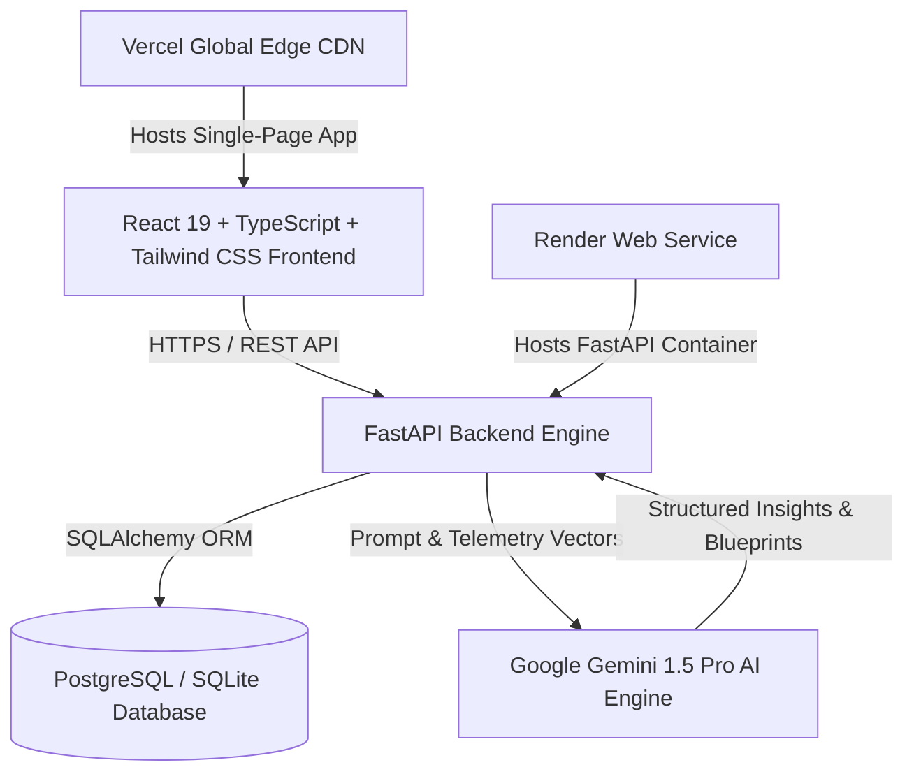

# ProjectPilot AI — System Architecture & Component Blueprint

This document details the high-level architecture, module design, data pipelines, and security model of **ProjectPilot AI**, an autonomous project management and telemetry platform.

---

## 1. System Overview Diagram

---

## 2. Component Architecture

### Frontend Layer
- **Framework**: React 19 with TypeScript, bundled using Vite.
- **Routing**: `react-router-dom` v7 with lazy route-splitting and `Suspense` fallbacks.
- **State & Data Fetching**: TanStack React Query v5 for server state caching, background invalidation, and optimistic UI updates.
- **Styling & Design System**: Tailwind CSS v3, Lucide React icons, and custom glassmorphism design tokens.
- **Resilience**: `ErrorBoundary` components, global Axios error interceptors, and `NetworkStatusBanner`.

### Backend Layer
- **Framework**: FastAPI (Python 3.11+).
- **ORM & Database Abstraction**: SQLAlchemy 2.0 supporting PostgreSQL in production and SQLite locally.
- **Configuration & Validation**: `pydantic-settings` for strongly-typed environment configuration.
- **API Routers**: Modular routes per domain resource (`projects`, `tasks`, `milestones`, `scope`, `risk`, `chat`, `planning`, `insights`, `team`, `analytics`, `reports`, `prd`, `notifications`).

### AI Intelligence Layer
- **LLM Engine**: Google Gemini 1.5 Pro API via `google-generativeai`.
- **Scope Audit Engine**: Real-time project telemetry analysis for parsing PRDs, detecting scope creep, schedule delays, and bottleneck risks.

---

## 3. Data Flow & Security

1. **Request Lifecycle**:
   - Client sends HTTP REST requests with JSON payloads.
   - FastAPI CORS middleware checks origin against configured allowlists.
   - Pydantic models validate request parameters.
   - SQLAlchemy parameterized queries interact safely with the database.

2. **Security Controls**:
   - HTTP Security Headers (`X-Content-Type-Options`, `X-Frame-Options`, `X-XSS-Protection`).
   - Environment variable isolation (`.env` file, zero hardcoded secrets).
   - Input sanitization & SQL injection immunity through ORM bindings.
