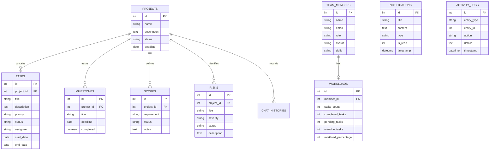

# ProjectPilot AI — Database Schema & Entity Relationship Diagram

This document describes the complete relational database schema for **ProjectPilot AI**, compatible with both SQLite and PostgreSQL.

---

## Entity Relationship Diagram (ERD)

---

## Entity Descriptions

- **PROJECTS**: Core project container tracking name, scope description, overall status (`active`, `completed`, `on_hold`), and target deadline.
- **TASKS**: Granular work items mapped to projects, priority (`critical`, `high`, `medium`, `low`), execution status (`todo`, `in_progress`, `review`, `done`), assignee, and timeline dates.
- **MILESTONES**: Key deliverable checkpoints with completion flags.
- **SCOPES**: Requirements baseline tracking implemented features vs out-of-scope/drift items.
- **RISKS**: Risk management matrix cataloging identified hazards, severity levels, and mitigation notes.
- **TEAM_MEMBERS & WORKLOADS**: Team roster tracking role responsibilities, active task loads, and percentage utilization.
- **NOTIFICATIONS & ACTIVITY_LOGS**: Real-time event streams and audit trails.
